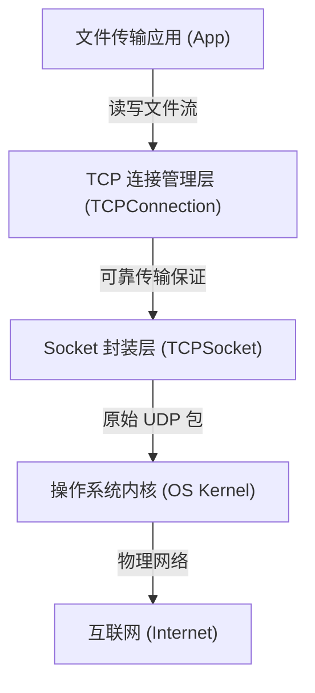

# 技术架构与算法原理文档 (Technical Design)

本文档旨在宏观阐述 "MyTCP" 项目的整体架构、模块划分以及核心算法原理，帮助开发者跳出代码细节，理解全局设计。

## 1. 总体架构 (System Architecture)

本项目本质上是在 **UDP (User Datagram Protocol)** 之上实现一个 **可靠传输层 (Reliability Layer)**。

### 核心分层模型
我们的程序运行在用户态 (User Space)，通过操作系统内核提供的 UDP Socket 发送数据。



*   **Socket 封装层 (TCPSocket)**: (已完成) 负责跨平台的 UDP 收发，不关心包的内容，只管把字节数组扔出去或收进来。
*   **TCP 连接管理层 (TCPConnection)**: (核心) 主要是 **状态机维护**、**序列号管理**、**超时重传**、**流量控制**。
*   **应用层 (App)**: 调用 send/recv 接口，类似标准 Socket 编程。

---

## 2. 模块职责与算法 (Modules & Algorithms)

### 2.1 连接管理 (Connection Management)
**核心算法：有限状态机 (Finite State Machine, FSM)**

TCP 不是简单的“发数据”，而是有状态的。我们需要维护一个状态变量 `state`。

*   **三次握手 (建立连接)**:
    1.  **Client (SYN_SENT)**: 发送 `SYN=1, seq=x`。算法：开启定时器，收不到 ACK 就重传 SYN。
    2.  **Server (SYN_RCVD)**: 收到 SYN，回复 `SYN=1, ACK=1, ack=x+1, seq=y`。算法：记录对方的 `seq`，准备接收数据。
    3.  **Client (ESTABLISHED)**: 收到 SYN-ACK，检查 `ack==x+1`，回复 `ACK=1, ack=y+1`。连接建立。
    4.  **Server (ESTABLISHED)**: 收到 ACK。连接建立。

*   **四次挥手 (断开连接)**:
    *   算法同理，利用 `FIN` 标志位。双方都要发送 FIN 并收到对方的 ACK 才能彻底关闭 (CLOSED)。

### 2.2 可靠传输 (Reliability)
**核心问题**：UDP 会丢包、乱序。
**解决方案**：ARQ (Automatic Repeat-request) 自动重传请求。

#### 初级算法：停止-等待 (Stop-and-Wait)
这是最简单的可靠传输算法。
1.  **发送方**：发送数据包 $P_1$，启动计时器。
    *   如果在 $T$ 时间内收到 $ACK_1$，则重置计时器，发送 $P_2$。
    *   如果在 $T$ 时间内**未**收到 $ACK_1$ (超时)，则**重传** $P_1$。
2.  **接收方**：
    *   收到 $P_1$，检查校验和。如果正确，回复 $ACK_1$，将数据交给上层。
    *   如果收到重复的 $P_1$ (因为 ACK 丢了导致重传)，丢弃数据，但**必须重发** $ACK_1$。

#### 进阶算法：滑动窗口 (Sliding Window)
为了提高信道利用率，我们采用**流水线 (Pipelining)** 传输。

**数据结构设计**：
1.  **发送环形缓冲区 (Send Ring Buffer)**:
    *   `SND.UNA` (Send Unacknowledged): 第一个已发送但未收到确认的字节序号。
    *   `SND.NXT` (Send Next): 下一个准备发送的字节序号。
    *   `SND.WND` (Send Window): 发送窗口大小。
    *   **可用窗口** (Usable Window) = `SND.UNA + SND.WND - SND.NXT`。
    
2.  **接收环形缓冲区 (Recv Ring Buffer)**:
    *   `RCV.NXT` (Receive Next): 期望收到的下一个字节序号。
    *   `RCV.WND` (Receive Window): 接收窗口剩余空间 (通告给发送方)。

**关键逻辑**：
*   **累积确认 (Cumulative ACK)**: 接收方回复 `ACK=N`，表示序号 `N-1` 及之前的所有字节都已正确收到。发送方收到后，可以将 `SND.UNA` 更新为 `N`，并释放缓冲区空间。
*   **Go-Back-N (GBN) vs Selective Repeat (SR)**:
    *   本项目建议实现 **SR 的简化版** (SACK 较复杂，可先做 GBN)。
    *   如果收到乱序包 (如等 Seq=100，来了 Seq=300)，**接收方应缓存 Seq=300** (存入 `map<seq, packet>`)，回复 `ACK=100`。
    *   当 Seq=100 到达后，检查缓存，发现 Seq=300 也在，立刻将 `RCV.NXT` 推进到 300+Length。

### 2.3 流量控制 (Flow Control)
**核心问题**：发送太快，接收方处理不过来，缓冲区爆了。
**算法**：
1.  接收方在回复 ACK 时，在 `window_size` 字段填入自己当前接收缓冲区还能装多少字节 (Current Buffer Size)。
2.  发送方收到 ACK 后，更新自己的发送上限。如果对方窗口为 0，则停止发送，哪怕网络很空闲。

### 2.4 拥塞控制 (Congestion Control)
**核心问题**：网络中链路带宽有限，如果不加控制地发送，会导致路由器队列溢出，造成网络拥塞，甚至“拥塞崩溃”。
**拥塞窗口 (cwnd)**：发送方维护的一个状态变量，表示在未收到 ACK 之前，网络中允许传输的最大数据量。

**四大核心算法**：

#### 1. 慢启动 (Slow Start)
*   **原理**：刚建立连接时，不知道网络的承载能力，因此“试探性”地增加发送量。
*   **初始状态**：`cwnd = 1 MSS` (Maximun Segment Size)。
*   **增长规则**：每收到一个 ACK，`cwnd += 1 MSS`。
    *   效果：每经过一个 RTT，`cwnd` **翻倍** (指数增长)。
*   **停止条件**：当 `cwnd >= ssthresh` (慢启动阈值) 时，切换到 **拥塞避免** 阶段。

#### 2. 拥塞避免 (Congestion Avoidance)
*   **原理**：此时网络容量已接近饱和，需要小心翼翼地增长。
*   **增长规则**：每收到一个 ACK，`cwnd += MSS * (MSS / cwnd)`。
    *   或者简化理解：每经过一个 RTT (即收到该轮所有 ACK)，`cwnd += 1 MSS`。
    *   效果：线性增长 (加法增大)。

#### 3. 快重传 (Fast Retransmit)
*   **触发条件**：接收方收到乱序包时，立即回复重复的 ACK (Duplicate ACK)。当发送方连续收到 **3 个重复 ACK** (3-dup ACKs) 时。
*   **动作**：
    *   不等超市计时器 (RTO) 到期，**立即重传** 那个丢失的包。
    *   认为此时网络只是轻度拥塞 (有包丢了但 ACK 还能回来)，不直接退回慢启动。

#### 4. 快恢复 (Fast Recovery) - (Reno 算法)
*   **触发**：发生快重传后。
*   **调整**：
    1.  `ssthresh = cwnd / 2`。
    2.  `cwnd = ssthresh + 3 MSS` (加上那 3 个收到的重复 ACK 确认的量)。
    3.  重传丢失包。
    4.  之后每收到一个重复 ACK，`cwnd += 1 MSS` (允许传输新数据)。
    5.  当收到新的数据 ACK (确认了重传包) 后，`cwnd = ssthresh`，进入 **拥塞避免**。

---

### 2.5 流量控制 vs 拥塞控制 (Flow Control vs Congestion Control)
*   **流量控制**：点对点。保护 **接收方** 不被淹没。(由接收方通告 `rwnd` 决定)
*   **拥塞控制**：全局性。保护 **网络链路** 不被堵死。(由发送方估算 `cwnd` 决定)
*   **最终发送窗口**：`EffectiveWindow = min(cwnd, rwnd)`。

---

## 3. 开发路线图 (Roadmap Refined)

基于这个架构，接下来的开发逻辑非常清晰：

1.  **Phase 2**: 实现 **状态机 (FSM)**。先不管丢包，只要能走通 SYN -> SYN-ACK -> ACK 流程，变状态即可。
2.  **Phase 3**: 实现 **Stop-and-Wait ARQ**。加入定时器线程，发一个包不走，非得等到 ACK 或超时才动作。
3.  **Phase 4**: 实现 **滑动窗口** (可选，看时间)。提高传输速度。
4.  **Phase 5**: 对接 **文件读写**。

### 4.4 实现算法伪代码 (Implementation Algorithms)

为了帮助你在 `tcp_connection.cpp` 中实现滑动窗口，以下是三个核心函数的详细算法流程：

#### A. 发送逻辑: `TCPConnection::send(data, len)`

**目标**：将数据放入发送窗口，如果窗口未满则立即发送。

```text
Function send(data, len):
    1. 计算当前飞行中的数据量 (FlightSize) = SND.NXT - SND.UNA
    2. 计算有效发送窗口 (EffectiveWindow) = min(cwnd, rwnd) - FlightSize
    
    3. 如果 EffectiveWindow < len:
        返回 false (窗口已满，暂时不能发)
        // 注意：实际 TCP 会拆分包发送剩余部分，这里简化为由应用层重试
    
    4. 创建新的 SendSegment:
        seg.seq = SND.NXT
        seg.len = len
        seg.data = copy(data)
        seg.lastSendTime = Now()
    
    5. 将 seg 放入 sendQueue 尾部
    
    6. 执行底层发送:
        sendPacket(FLAG_ACK, seg.data, seg.len)
    
    7. 更新 SND.NXT += len
    
    8. 返回 true
```

#### B. 接收逻辑: `TCPConnection::processPacket(header, ...)`

**目标**：处理累积确认，清理发送队列，推动窗口滑动。

```text
Function processPacket(...):
    ...
    // 假设收到了 FLAG_ACK
    ACK = header.ack_num
    
    // 1. 检查是否是新的确认 (ACK > SND.UNA)
    If ACK > SND.UNA:
        // 遍历发送队列，移除所有已被确认的段
        While (sendQueue is not empty) AND (sendQueue.front().seq + len <= ACK):
            Remove front segment from sendQueue
        
        // 更新基准指针
        SND.UNA = ACK
        
        // (可选) 触发快速重传检测：如果收到 3 个重复 ACK (ACK == SND.UNA)，则立即重传队头
    
    // 2. 处理接收数据 (乱序缓冲)
    SEQ = header.seq_num
    If SEQ == RCV.NXT:
        // 既然是期望的包，写入 inBuffer
        Write to inBuffer
        RCV.NXT += data_len
        
        // *关键*：检查 outOfOrderBuffer 是否有后续的包现在可以接上了？
        While (outOfOrderBuffer contains RCV.NXT):
            Extract packet from map
            Write to inBuffer
            RCV.NXT += packet_len
            Remove from map
    Else If SEQ > RCV.NXT:
        // 乱序包，存入 map
        outOfOrderBuffer[SEQ] = data
        Send ACK (AckNum = RCV.NXT) // 告诉对方我还在等 RCV.NXT
```

#### C. 超时检测: `TCPConnection::checkTimeout()`

**目标**：遍历队列，重传超时包。

```text
Function checkTimeout():
    CurrentTime = Now()
    
    For each segment in sendQueue:
        If segment.isSent AND (CurrentTime - segment.lastSendTime > RTO):
            // 超时了！
            Resend segment
            segment.lastSendTime = CurrentTime
            segment.retries++
            
            // (可选) RTO 倍增 (Exponential Backoff)
            // RTO *= 2
```
